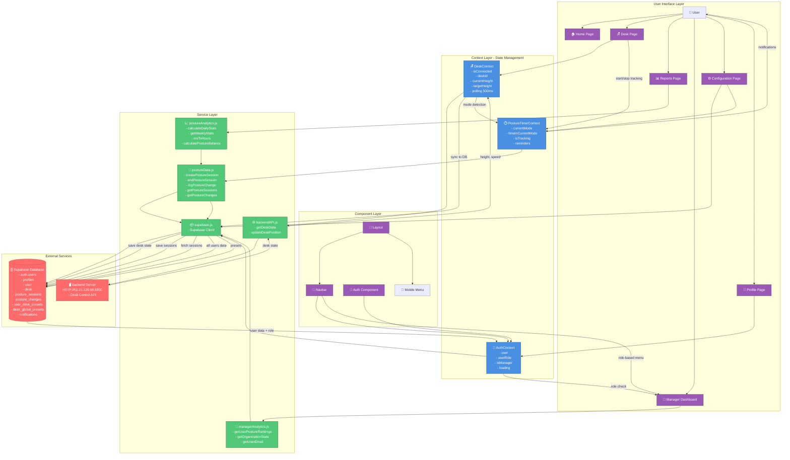
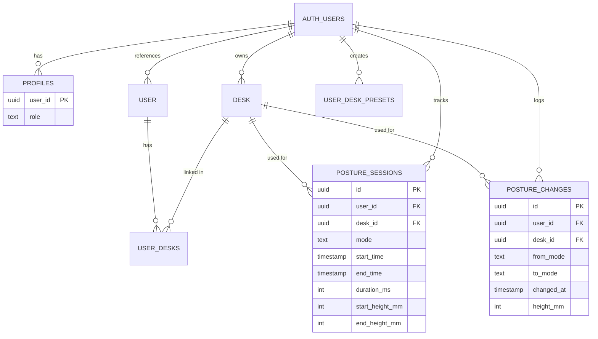

# Smart Desk App - Data Flow Diagram

## Complete System Architecture



## Detailed Data Flows

### 1. Authentication Flow
```
User Login
    ↓
Auth Component
    ↓
AuthContext.signIn()
    ↓
Supabase Auth
    ↓
auth.users table
    ↓
profiles table (fetch role)
    ↓
AuthContext (user, userRole, isManager)
    ↓
All protected components
```

### 2. Desk Control Flow
```
User clicks "Connect"
    ↓
DeskContext.connectToDesk()
    ↓
backendAPI.getDeskData()
    ↓
Backend Server (HTTP GET)
    ↓
Backend returns {deskData: {height, speed, ...}}
    ↓
DeskContext state update
    ↓
Start 500ms polling interval
    ↓
Every 500ms: fetch desk state
    ↓
Mode detection (height > 900mm = standing)
    ↓
PostureTimerContext.changeMode()
    ↓
Save to posture_sessions table
```

### 3. Position Change Flow
```
User clicks preset button
    ↓
DeskContext.moveDeskToHeight(height)
    ↓
backendAPI.updateDeskPosition(deskId, height)
    ↓
Backend Server (HTTP POST)
    ↓
Desk motor moves
    ↓
Polling detects height change
    ↓
When speed === 0 (stopped):
    ↓
Sync final height to desk table
```

### 4. Posture Tracking Flow
```
User on Desk page + connected
    ↓
PostureTimerContext.startTracking(mode, height, deskId)
    ↓
postureData.createPostureSession()
    ↓
INSERT into posture_sessions table
    ↓
Timer starts (Date.now() based)
    ↓
User changes position
    ↓
DeskContext detects mode change
    ↓
PostureTimerContext.changeMode(newMode, height, deskId)
    ↓
postureData.endPostureSession() + logPostureChange()
    ↓
UPDATE posture_sessions + INSERT posture_changes
    ↓
postureData.createPostureSession() (new session)
    ↓
Timer resets for new mode
```

### 5. Reports Generation Flow
```
User navigates to Reports
    ↓
Reports.jsx useEffect
    ↓
postureAnalytics.getWeeklyStats(userId, 7)
    ↓
postureData.getPostureSessions(userId, dateRange)
    ↓
Supabase query posture_sessions
    ↓
Calculate aggregations (sitting/standing time, averages)
    ↓
Transform data for charts
    ↓
postureAI.generatePostureInsights(stats)
    ↓
Gemini API request
    ↓
AI returns {habits, tips}
    ↓
Render charts + AI insights
    ↓
Fallback to rule-based analysis if AI fails
```

### 6. Manager Dashboard Flow
```
Manager logs in
    ↓
AuthContext fetches role from profiles table
    ↓
Navbar shows Manager menu item (if isManager)
    ↓
Manager navigates to /manager
    ↓
Manager.jsx useEffect
    ↓
managerAnalytics.getUserPostureRankings(7)
    ↓
Supabase query posture_sessions (ALL users via RLS)
    ↓
Group by user_id, calculate metrics
    ↓
Sort by balance score
    ↓
Parallel fetch user emails from user table
    ↓
Render rankings table + org stats
```

### 7. Notification Flow
```
PostureTimerContext monitors timeInCurrentMode
    ↓
Check reminder settings (localStorage)
    ↓
Time >= reminder.frequency?
    ↓
useNotifications.sendPostureReminder()
    ↓
Browser Notification API
    ↓
User sees desktop notification
```

## Database Schema Relationships



## Key Features Summary

### ✅ Implemented Features

1. **Authentication System**
   - Sign up / Sign in / Sign out
   - Role-based access (user / manager)
   - Profile management
   - RLS security policies

2. **Desk Control**
   - Real-time desk connection
   - Position control (move to height)
   - Live height monitoring (500ms polling)
   - Preset management (global + user)
   - Auto-reconnect on Connect button

3. **Posture Tracking**
   - Automatic mode detection (sitting/standing)
   - Timestamp-based timer (browser-throttle resistant)
   - Session recording to database
   - Change event logging
   - Configurable reminders

4. **Reports & Analytics**
   - 7-day posture history
   - Sitting vs standing charts
   - Posture change frequency
   - Session duration analysis
   - AI-powered insights (Gemini)
   - Fallback rule-based analysis

5. **Manager Dashboard**
   - Organization-wide statistics
   - User posture rankings
   - Balance score calculation
   - Read-only access to all data

6. **Configuration**
   - Height preset management
   - Reminder settings
   - Dark mode support

## Technology Stack

- **Frontend**: React 18 + Vite
- **Routing**: React Router v6
- **Styling**: Tailwind CSS
- **Charts**: Recharts
- **Icons**: Lucide React
- **State Management**: React Context API
- **Database**: Supabase (PostgreSQL)
- **Authentication**: Supabase Auth
- **AI**: Google Gemini API
- **Backend**: Node.js REST API (external)

## Security Implementation

- **Row Level Security (RLS)**: Users see only their own data
- **Manager Policies**: `is_manager()` function with SECURITY DEFINER
- **API Keys**: Environment variables (.env)
- **Authentication**: JWT tokens via Supabase
- **HTTPS**: SSL encryption for all API calls
